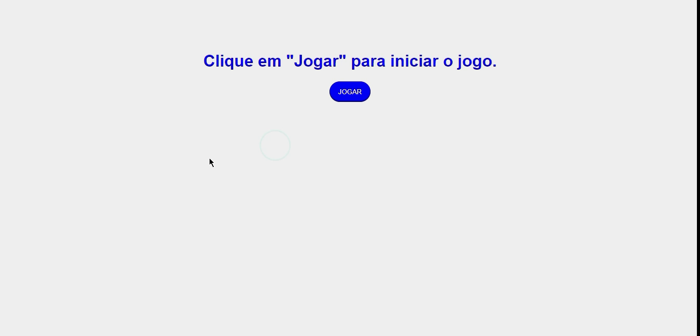

---

<div style="text-align: justify">

### Descrição
Uma versão simplificada do famoso jogo da cobrinha, esse projeto foi desenvolvido em JavaScript durante o bootcamp JavaScript Game Developer da plataforma Digital Innovation One.

</div>

---

#### Link da Plataforma:

* [Digital Innovation One](https://digitalinnovation.one/)

---

Esse projeto foi desenvolvido com as seguintes tecnologias:
* HTML5
* CSS3
* JavaScript

---

Para ver o projeto você pode clonar ele com o seguinte comando:    

```sh
git clone https://github.com/ale-mouraboni/snake-game.git
```  
  
Você também pode baixar o arquivo .zip do projeto, basta clicar no botão abaixo.  
  
[Baixar Projeto](https://github.com/ale-mouraboni/snake-game/archive/refs/heads/main.zip)

---

### License
This project is under the MIT license. See the [LICENSE] for more information.

---